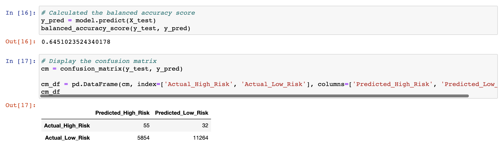
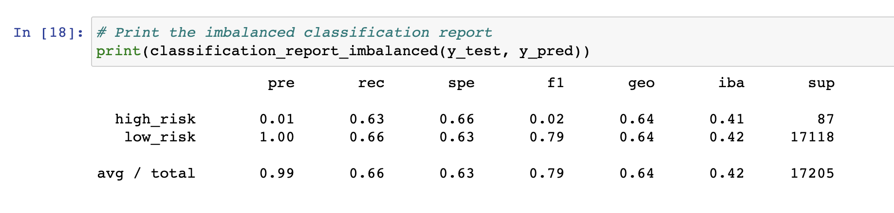
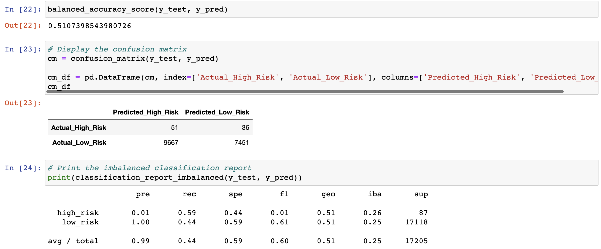
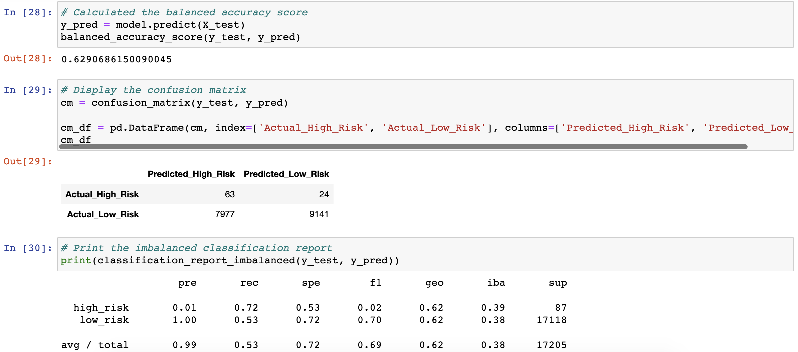
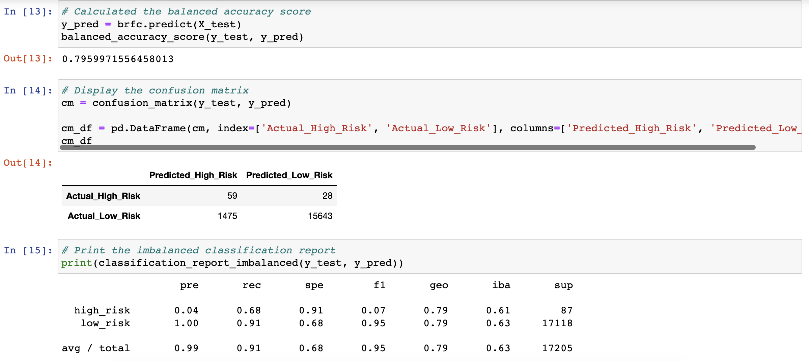
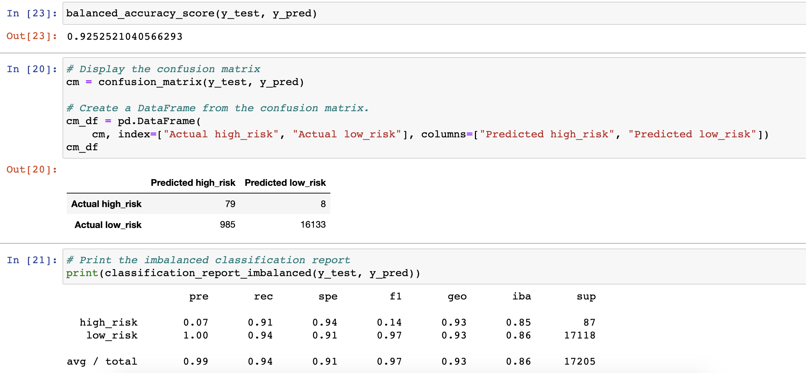

# Credit_Risk_Analysis

## Project Overview
Build and evaluate several machine learning models to make a recommendation on whether they should be used to predict credit risk. The following algorithms have been used:

* The **RandomOverSampler** and **SMOTE** algorithms to oversample the data
* The **ClusterCentroids** algorithm to undersample the data
* **SMOTEENN** algorithm to use a combinatorial approach of over and undersampling
* **BalancedRandomForestClassifier** and **EasyEnsembleClassifer** algorithms

## Results - screenshots of each model's results

### RandomOverSampler

The balanced accuracy score is 63%. The high_risk precision is 1% with 60% sensitivity and the F1 score is about 2%. There's a great number of the low_risk population, and its precision makes up almost 100% with 67% sensitivity.

### SMOTE

The results are quite the same as the previous one. The balanced accuracy score is about 64%. The high_risk precision is about 1% with 63% sensitivity and a F1 score of 2%. There's also a great number of the low_risk population and its precision is almost 100% with 66% sennsitivity.

### ClustersCentroid

The balanced accuracy score is down to 51%. The high_risk precision is still 1% with 59% sensitivity and a F1 score of 1%. Because of the high volume of False Positives, the low_risk sensitivity is about 44%.

### SMOTEENN

The balanced accuracy score is about 62%. The high_risk precision is still 1% with 72% sensitivity and a F1 score of 2%. Because of the high volume of False Positives, the low_risk sensitivity is 53%.

### BalancedRandomForestClassifier

The balanced accuracy score went up to about 79%. The high_risk precision is still low at 4% with 68% sensitivity and a F1 score of 7%. Because of the lower number of False Positives compared to the ones above, the low_risk is now 91% with 100% precision.

### EasyEnsembleClassifier

The balanced accuraccy score is now very high at about 93%. The high_risk precision is still low at 7% with 91% sensitivity and a F1 score of 14%. Because of the lower number of False Positives, the low_risk sensitivity is now at 94% with 100% precision.

## Summary
Every model demonstrated weak precision when it comes down to analyizing the high_risk credits. The Ensemble models showed the bigger numbers for the sensitivity of the high_risk credits than the resampling ones. Especially, the **EasyEnsembleClassifier** gave `91%` sensitivity so it caught most of the high_risk credits. However, since arguably many `actual low_risk credits` were still falsely predicted as high_risk and it could negatively affect the bank's credit strategy increasing its revenue by missing the business opportunities, these tested models should be considered not as trust-worthy.