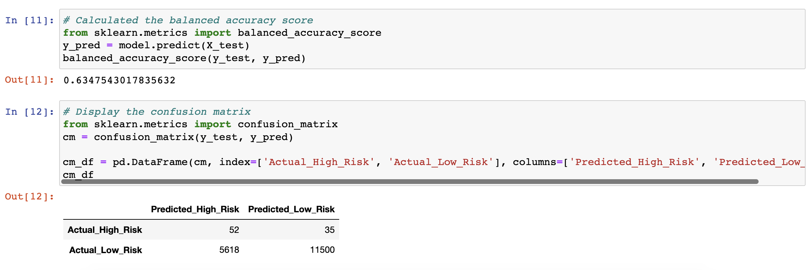
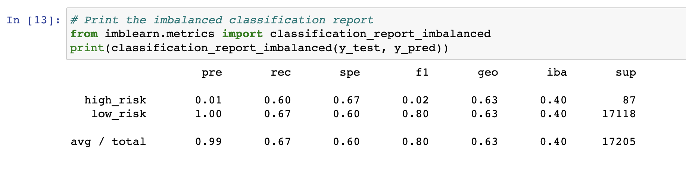

# Credit_Risk_Analysis

## Project Overview
Build and evaluate several machine learning models to make a recommendation on whether they should be used to predict credit risk. The following algorithms have been used:

* The **RandomOverSampler** and **SMOTE** algorithms to oversample the data
* The **ClusterCentroids** algorithm to undersample the data
* **SMOTEENN** algorithm to use a combinatorial approach of over and undersampling
* **BalancedRandomForestClassifier** and **EasyEnsembleClassifer** algorithms

## Results - screenshots of each model's results

### RandomOverSampler

